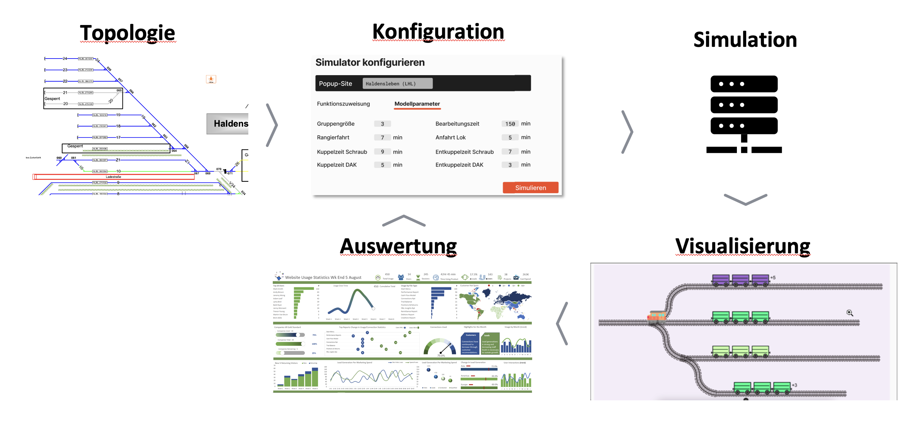
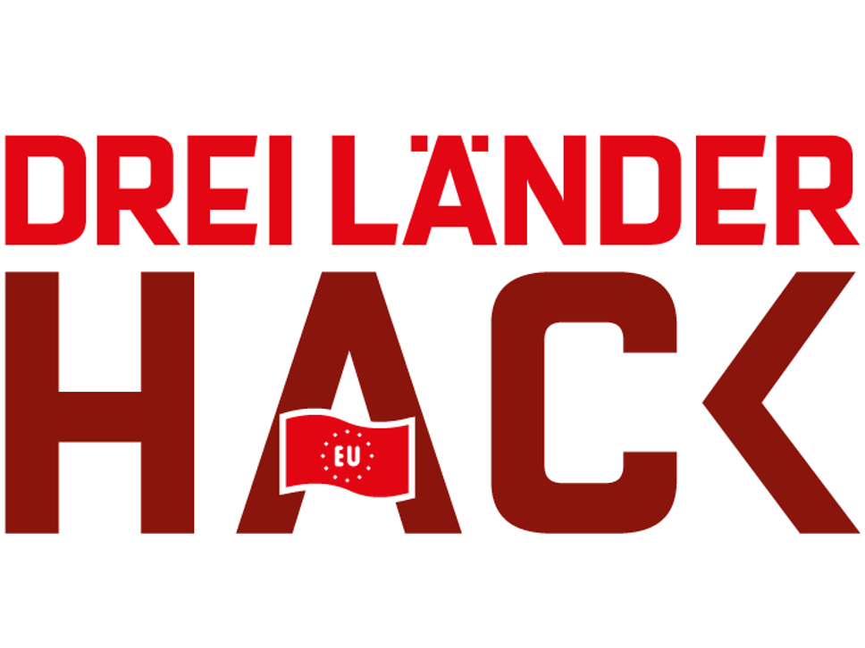

# PopUpSim

PopUpSim is a simulation tool, that models a problem in the freight rail transport industry. The Control Center allows the user to assign functions to a predefined (but modifiable) topology of tracks. The user can then choose a set of model parameters and run a simulation. The simulator will take the parameters and simulate the retrofit process of freight wagons along the given parameters. The visualizer will then present the results and inform the user about the key results of the simulation. The user can also "debug" the simulation with a time travel function to get a feeling of the bottlenecks.

The Frontend is deployed on GitHub pages: https://openrail-playground.github.io/PopupSim/

The backend cannot be easily deployed with additional infrastructure, see [Install](#install) for details on how to run it locally. The Frontend can still be used without the backend, it will use a sample set of a simulation to demo the functionality.

## Background

  

This project has been initiated during
the [Dreiländerhack 2024](https://data.deutschebahn.com/opendata/Veranstaltungen/DreiLaenderHack-2024-12737424), a joint
hackathon organised by the railway companies ÖBB, DB, and SBB.

The freight rail transport industry needs a Digital Automatic Coupler (DAC) for further digitalization and automation (including ETCS and more). But how do we retrofit around 500,000 vehicles across Europe when they are often coupled
together?

Various migration scenarios have been developed. Since freight rail transport is interwoven across Europe and different rail companies, one idea is to retrofit a large share of the wagons (approximately 210,000) nearly simultaneously in a so-called "big bang."

This is a critical phase lasting about 3 weeks: wagons need to be pulled out of service and sent to all available workshops and additional temporary so-called pop-up workshops.
After being retrofitted there, they need to be parked, as they are no longer compatible with the existing productive system.
Then comes the moment of system changeover—retrofitted wagons need to be brought back into service as quickly as possible, and non-retrofitted wagons
need to be parked as quickly as possible.
This requires tracks, personnel, and shunting resources.
This phase must be planned very precisely, and experts are keenly discussing how it can succeed.
Therefore, the challenge is to build a microscopic simulation tool for this purpose.

## Install

See the Readmes of the sub components for detailed installation instructions. In order to run, you need `python` and `npm`. Spinning up both the control center and the simulator will open up two web servers on port `8000` and `8080`, they will be integrated by default on localhost.

Alternatively the frontend will run without the simulator and load a sample set, so that the functionality can be developed without the backend. This works if you click on "Result|Ergebnis" without trying to start a simulation.

## Develop

A new push to the main branch will automatically trigger a build.

## License

The content of this repository is licensed under the [Apache 2.0 license](LICENSE).
