# How To authenticate

The PopUpSim-ControlCenter initiates a login through the backend (OAuth2 Authorization Code
Flow with Confidential Client).
After successful login the frontend is coupled to the backend session through a
session cookie.
The login process involves four redirects:
FE->BFF, BFF->IdP, IdP->BFF and finally BFF->FE.

The BFF provides a `/auth/userinfo` endpoint to which responds with the user
data as well as a `csrfToken`.
This token must be included in all mutating requests (all HTTP request methods
except `GET`, `HEAD` and `OPTIONS`).
Also all API call requests must be made using the `withCredentials` option
which attaches the cookie.
This way, the BFF verifies, the connected frontend is allowed to use the API
by validating the cookie.

```mermaid
sequenceDiagram
  participant Frontend
  participant BFF
  participant IdP

  link BFF: BFF @ https://sc-bff-nestjs-ttweb.apps.dbcs-riga.comp.db.de

  Note over Frontend,BFF: Unauthenticated
  Frontend->>BFF: GET /auth/userinfo
  activate BFF
  BFF-->>Frontend: 200 OK { "loggedIn": false }
  deactivate BFF

  Frontend->>BFF: GET /quotes
  activate BFF
  BFF-->>Frontend: 403 Forbidden
  deactivate BFF

  Note over Frontend,IdP: Start authentication
  Frontend->>BFF: redirect to BFF with return URL to Frontend
  rect rgb(100, 100, 150)
  Note over BFF,IdP: OAuth2 Flow
  BFF->>IdP: redirect to IdP with return URL to BFF
  activate IdP
  IdP-->>BFF: redirect to BFF
  deactivate IdP
  end


  BFF-->>Frontend: redirect to Frontend

  Note over Frontend,IdP: Authenticated

  rect rgb(120, 150, 150)
  Note over Frontend,BFF: Session
  note left of Frontend: Session Cookie 🍪
  Frontend->>BFF: GET /auth/userinfo
  activate BFF
  BFF-->>Frontend: 200 OK { "loggedIn": true, "user": { ... }, "csrfToken": "<token>"  }
  deactivate BFF
  note left of Frontend: CSRF Token 🔑
  Frontend->>BFF: GET /quotes
  activate BFF
  BFF-->>Frontend: 200 OK [ { ... } ]
  deactivate BFF
  note right of BFF: CSRF Token must be included<br/>in all mutating requests
  Frontend->>BFF: 🔑 POST /quotes { ... }
  BFF-->>Frontend: 200 OK { ... }
  activate BFF
  deactivate BFF
  end
```

You can checkout the BFF source code and run it locally for testing purpose.
Please refer to the [sc-bff-nestjs Repository](https://git.tech.rz.db.de/db-inner-source/tt-web/Showcases/sc-bff-nestjs).

## Environment configuration

The authentication endpoint and configuration relies on the endpoint configured in the `VITE_BACKEND_URL` env variable.
The following table shows the different `.env` files and when/how they will be used.

| filename              | usage example   | description                                                                                                   |
|-----------------------|-----------------|---------------------------------------------------------------------------------------------------------------|
| `.env`                | automatic       | This file contains shared environment configuration variables used across all stages                          |
| `.env.local`          | `npm run dev`   | This file contains variables used when working locally by default. This file is `.gitignored`'ed by intention |
| `.env.local.template` | never           | This is just a blueprint for the `.env.local` file that's checked-in and can be copied                        |
| `.env.production`     | `npm run build` | This file contains variables used when building the app in an CI environment                                  |

For further details about the Vite `build`/`start` option `mode` and environment configuration have a look the [Vite docs](https://vitejs.dev/guide/env-and-mode.html).
